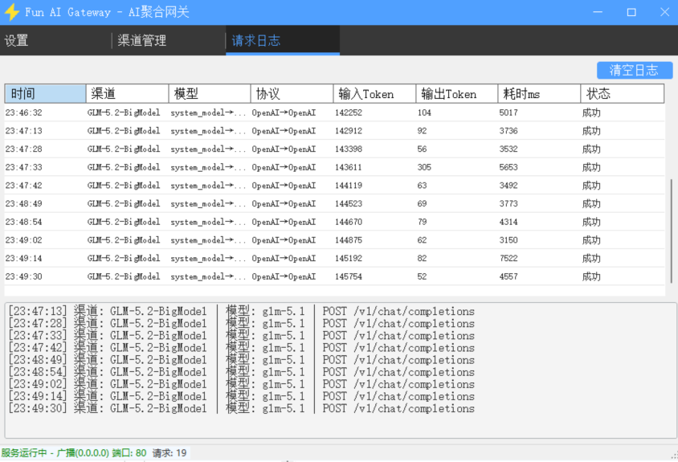

# FunAiGateway

一个轻量级的 AI API 中转网关，支持 OpenAI 和 Anthropic 协议互转，让你用一个统一接口访问不同的大模型服务商。

## 预览截图




## 功能特性

### 协议转换
- **OpenAI ↔ Anthropic 双向转换**：客户端用 OpenAI 格式请求，网关自动转换为 Anthropic 格式调用上游，反之亦然
- **流式（SSE）和非流式响应双向完整支持**
  - Anthropic 上游流式 → OpenAI 客户端流式：`message_start` / `content_block_delta` / `message_delta` / `message_stop` 全量事件转换
  - OpenAI 上游流式 → Anthropic 客户端流式：动态生成 `content_block_start` / `content_block_delta` / `content_block_stop` / `message_delta` / `message_stop`
  - 多个 `tool_calls` 在流式中按正确的 block 顺序逐个 start/stop 输出
- 支持视觉、函数调用等高级特性
  - 多模态图片（data URI / 远程 URL）在两种协议间互转
  - `tool_calls` ↔ `tool_use`、`tool` role ↔ `tool_result` 互转（流式增量 arguments 通过 `input_json_delta` 透传）
  - system role 自动提取为 Anthropic 顶层 `system` 字段
  - `stop_reason` / `finish_reason` 与 `usage` 字段对应映射（stop→end_turn、length→max_tokens、tool_calls→tool_use）

### 渠道管理
- 添加/编辑/删除多个渠道
- 每个渠道可配置独立的模型、超时、重试次数
- 支持自定义请求头（JSON 格式）
- 支持模型名称映射（对外名称 ≠ 实际模型名）
- 每个模型可声明能力：上下文长度、最大输出 tokens、是否支持流式 / 视觉 / 函数调用

### 双端点路由
- 每个渠道可同时配置 **OpenAI 端点** 和 **Anthropic 端点** 两套 Base URL + API Key
- 转发时自动选择与请求同协议的端点直连，避免不必要的协议转换开销
- 任一端点留空即表示该渠道不提供该协议接入

### 代理支持
- 每个渠道可独立配置 HTTP / SOCKS5 代理
- 支持 HTTP 和 SOCKS5（含用户名/密码认证）
- 未启用代理时走直连，不使用系统代理

### 请求路由
- `system_model` 虚拟模型：请求可统一发到 `system_model`，在界面上随时切换它指向的真实渠道
- 自动匹配启用的渠道和模型
- 未配置默认模型时自动退化到第一个可用模型，客户端无需改动即可切换

### API Key 管理
- 多 Key 支持，每个 Key 可独立配置：备注、启用状态、剩余调用次数、到期时间
- 模型白名单：每个 Key 可限定允许访问的模型列表，留空表示允许全部
- 鉴权通过即扣减次数（即使请求中途断开，上游已产生费用）
- OpenAI 协议解析 `Authorization: Bearer`；Anthropic 协议优先 `x-api-key`，兼容 `Authorization: Bearer`
- 返回状态码区分：401（无效）/403（越权/过期）/429（次数耗尽）

### 监听模式
- **本地模式**：仅监听 `127.0.0.1`
- **广播模式**：监听 `0.0.0.0`，支持外网访问
- 支持自定义域名/IP 用于外网访问时自动生成连接信息

### 自动重试与错误处理
- 非流式请求遇 5xx / 429 / 408 / 425 / 网络异常自动重试，次数由渠道配置，每次固定延迟 5 秒
- 流式请求读取首个 SSE 事件块检测 error，含错误且仍有重试机会则丢弃当前流并重试
- **错误脱敏**：上游错误对客户端返回模糊提示，服务端日志详细记录渠道/模型/状态码/响应体

### 日志系统
- **请求日志**：记录时间、渠道、模型、协议、Token 用量、耗时、状态
- 日志按天分割，单文件超过 50MB 自动滚动
- 超过配置条数上限自动裁剪最早记录，按保留天数自动清理过期文件
- 启动时不回显历史日志，仅显示当前会话记录
- **响应内容日志**：可选开关，按状态码范围（2xx 成功 / 4xx 客户端错误 / 5xx 服务端错误 / 其他）决定是否落盘上游响应体
- **阈值配色显示**：响应耗时、输入 Token、输出 Token 按用户配置阈值着色（绿/黄绿/橙/红）

### Portal 自助查询
- 内置响应式 HTML 页面（`/portal`），手机与电脑均友好
- 用户输入 API Key 即可查询：可用模型、上下文长度、最大输出、剩余次数、到期时间、状态
- 提供 OpenAI / Anthropic 两种协议的 curl 使用示例与一键复制
- `/portal/api/keyinfo` 接口对每 IP 每分钟限流 10 次，防止 Key 枚举

### 其他
- 启动时自动启动服务（可选）
- 透传客户端 `User-Agent` 到上游
- 连接信息自动生成（OpenAI / Anthropic / 模型列表接口地址），支持一键复制
- 跨域支持：自动处理 CORS 预检并回显请求方 `Origin`

## 快速开始

### 环境要求
- .NET 8.0 SDK（开发/编译）
- Windows 操作系统


### 使用方法

1. 启动 `FunAiGateway.exe`
2. 在 **设置** 页配置监听端口、API Key、默认模型
3. 在 **渠道** 页添加 AI 服务商渠道，按需填入 OpenAI 和/或 Anthropic 端点的 Base URL 和 API Key
4. 点击 **启动服务**
5. 客户端使用生成的接口地址发请求

### 接口地址

| 接口 | 地址 |
|------|------|
| OpenAI Chat | `http://<host>:<port>/v1/chat/completions` |
| OpenAI Completions | `http://<host>:<port>/v1/completions` |
| Anthropic Messages | `http://<host>:<port>/v1/messages` |
| 模型列表 | `http://<host>:<port>/v1/models` |

## 客户端配置示例

### OpenAI 客户端
```python
from openai import OpenAI

client = OpenAI(
    base_url="http://127.0.0.1:80/v1",
    api_key="your-gateway-key"
)

response = client.chat.completions.create(
    model="system_model",
    messages=[{"role": "user", "content": "Hello!"}]
)
```

### Anthropic 客户端
```python
import anthropic

client = anthropic.Anthropic(
    base_url="http://127.0.0.1:80",
    api_key="your-gateway-key"
)

message = client.messages.create(
    model="system_model",
    max_tokens=1024,
    messages=[{"role": "user", "content": "Hello!"}]
)
```


## License

GPL-3.0
